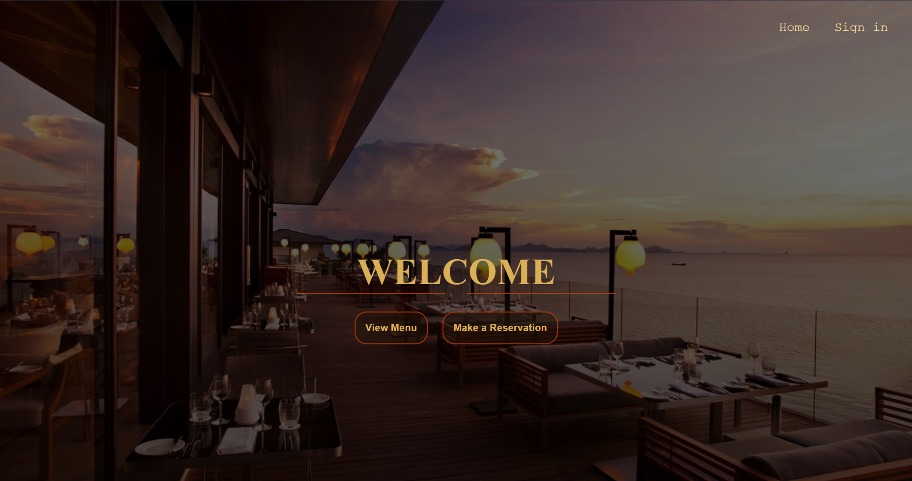
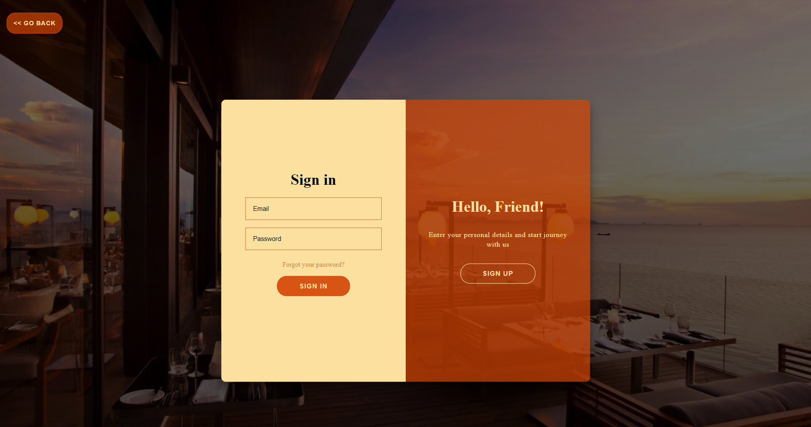
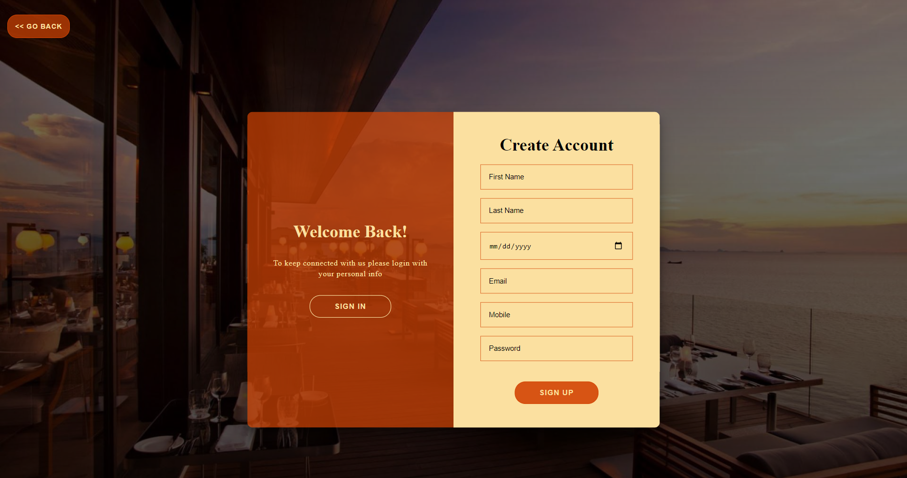
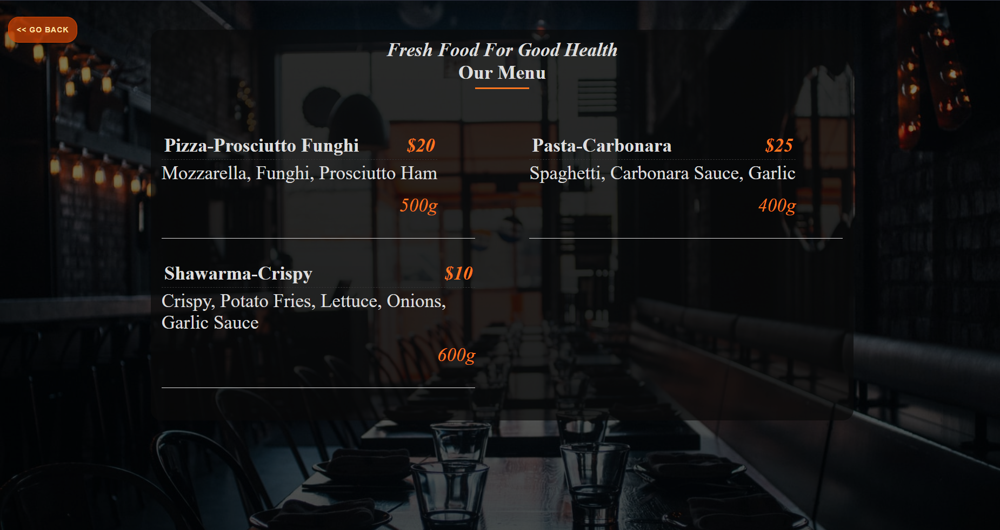
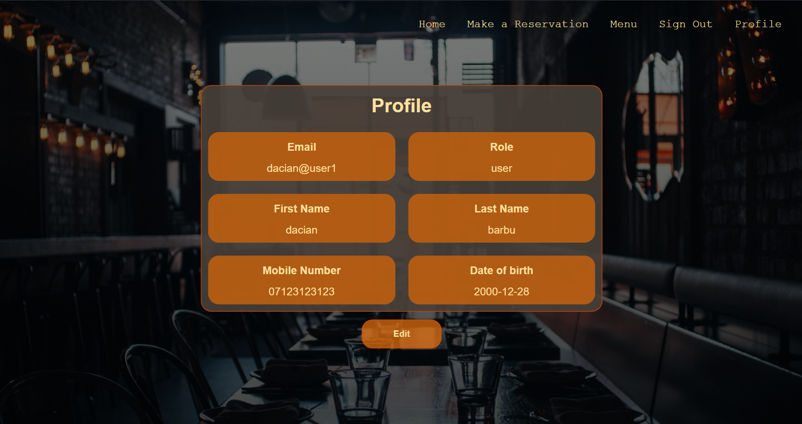
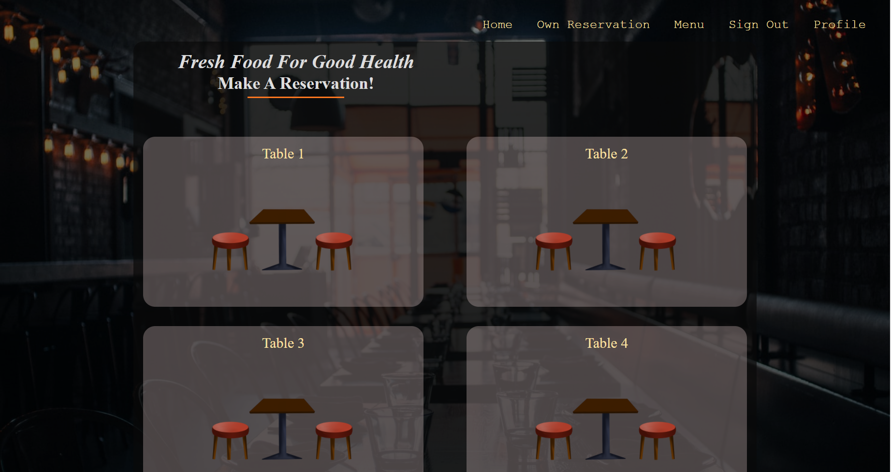
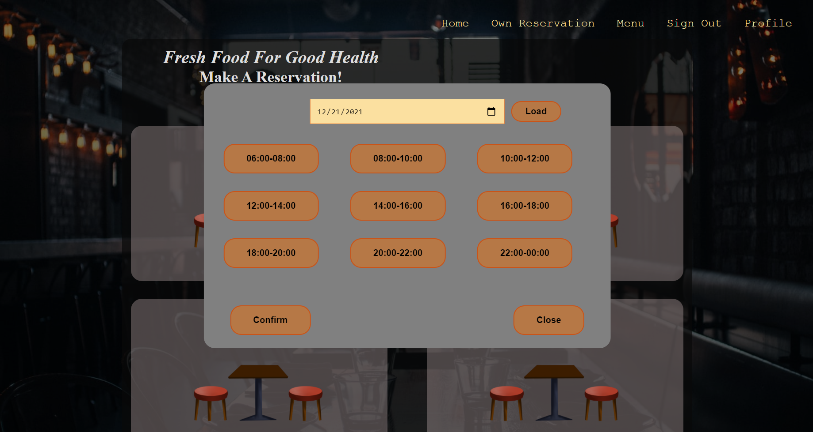
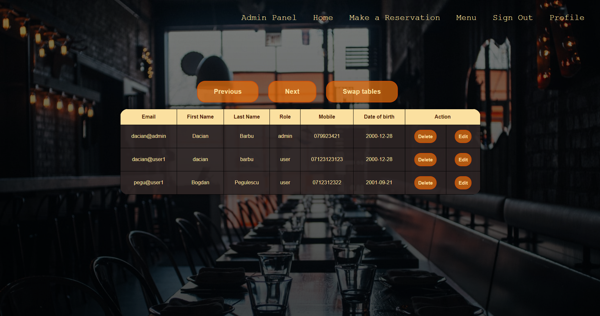
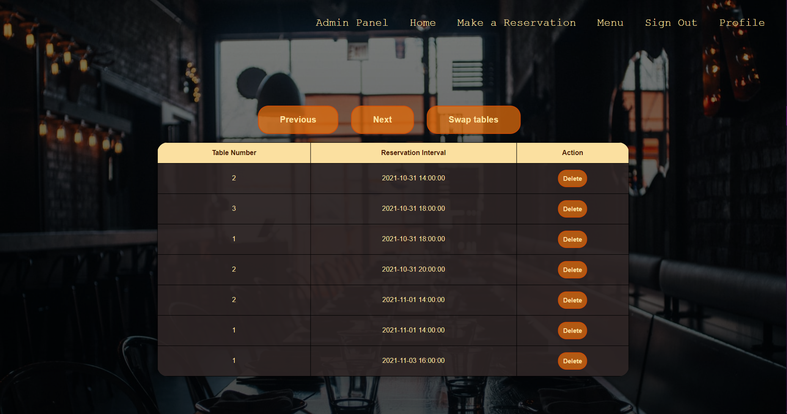

# Reservation-App
This is a reservation application that aims both clients and the staff of a restaurant, having many useful features. The clients, on the one hand, can create an account
to make online reservations, or they can use the webpage without an account for checking out the menu. 
On the other hand, the staff has the same functionality as the clients but they can also view and edit the menu, the user accounts or remove reservations.

The app was developed using the following technologies:
* Java 11
* Maven 3.8.2
* Spring Boot 2.5.5
* Node 14.17.5
* Npm 6.14.14
* Vue JS 3.2.19
* MySql DB

## Prerequisites

To be able to install and run this project, please make sure you have installed Java 11 or higher, Node 14.17.5 and Npm 6.14.14. Otherwise, the setup will note work! 
To check your java version, please run `java -version` in the command line.
It would be good if you also installed Maven to your system. To check if you have Maven installed run `mvn -version`.
To check your Node version, please run `node -v` in the command line.
To check your Npm version, please run `npm -version` in the command line.

## Setup & Run
To set up and run the project locally on your machine, please follow the next steps.

### Clone the repository
Clone the repository using:
```git
git clone https://github.com/Daci1/ReservationApp.git
```


# Demo:

### Home Page



### Sign-in Page




### Register Page



### Menu Page



### Profile Page



### Tables Page



### Reservation View



### Admin Panel Accounts View



### Admin Panel Reservations View


